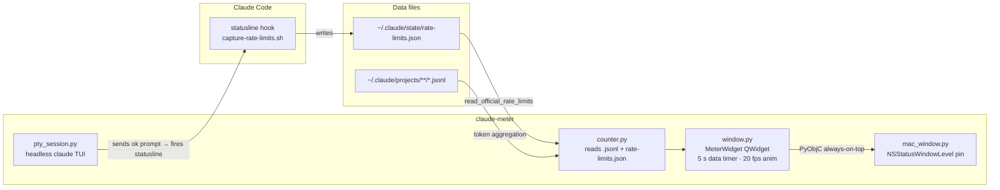

# claude-meter

[](LICENSE)
[](https://www.python.org/)
[](https://pypi.org/project/PyQt5/)

**Always-on-top macOS HUD that shows your Claude Code 5-hour and weekly token budget as two concentric rings — every visual property carrying real signal, no labels, no estimates.**

**Status:** v0.5 — stable; data stays live across 5h window resets; 2-minute self-refresh via headless pty keepalive; monotonic guard prevents stale-session writes from overwriting fresher data.

[Live demo →](https://casterlygit.github.io/claude-meter/)

---

## What the rings actually say

Every visual property carries information — nothing is decorative:

| What you see | What it means |
|---|---|
| **Arc length** | % of that window's ceiling you've spent |
| **Hue family** | Outer = 5h (cyan → coral → magenta). Inner = weekly (lime → amber → red-orange) |
| **Hue tier** | Calm / warning / danger — shifts at 65% and 85% |
| **Pace tick on the track** | Where you'd be at linear pace. Arc past the tick = burning hot |
| **Comet tail (outer ring)** | Length is proportional to your tokens-per-minute over the last 5 minutes; full tail = 50k tpm |
| **Dashed overflow** | Past 100%, arc continues dashed into a second lap |
| **Center stack** | `NN% USED` / `ON PACE` / `4h 43m` — same hue, three weight tiers, verdict in the middle |
| **Pills inside each ring** | The literal % for that window, color-matched, near the bottom of the ring |
| **Side panel (left)** | Two rails (5h, weekly) with colored fill + white tick for pace; under each rail the wall-clock reset time (`resets 11:43 pm`, `resets Sun 11:43 pm`) — when, not how long |

## Why this exists

Anthropic doesn't expose your 5-hour / weekly quota as a queryable API. The Claude Code app shows the gauge when you click into it; the desktop app and VS Code extension don't write it anywhere external processes can read. claude-meter pulls it from the statusline hook — the one path Anthropic does expose — and pins it where you can glance at it.

Knowing how much of your 5h window is left changes how you plan a session. At 70% with 90 minutes to go, you slow down. At 12% with 30 minutes left, you push.

## Architecture



**Data flow in detail:**

- `capture-rate-limits.sh` is registered as Claude Code's `statusLine` hook; it fires every 30s and writes `~/.claude/state/rate-limits.json` with the raw Anthropic rate-limit payload.
- `counter.py` reads that file (authoritative: same `used_percentage` + `resets_at` the in-app gauge shows) and the transcript `.jsonl` files for burn-rate and comet-tail calculation.
- `pty_session.py` owns a persistent headless `claude` TUI in a pseudo-terminal. The refresh button sends a single `ok\r` prompt (~0.5¢ Haiku), causing the TUI to re-render and fire the statusline hook. A background keepalive sends the same prompt every 2 minutes so data stays live even when the TUI is otherwise idle.
- `MeterWidget` runs four timers: `_data_timer` (5s reads data), `_pin_timer` (2s pins window level), `_auto_refresh_timer` (120s fires unconditional pty refresh), `_anim_timer` (50ms / 20fps for comet + pace pulse).
- The monotonic guard in `capture-rate-limits.sh` rejects writes that would lower the recorded percentage within the same 5h window — multiple concurrent `claude` sessions race on this file, and only the highest reading wins until `resets_at` advances.

## Getting out of the way

The widget pins to the top-right of your rightmost monitor — right where macOS menu-bar dropdowns and Spotlight render. So:

- **Click the chevron** (top-right of the widget) → collapses to a **42px progress pillar**: a dark circle that fills bottom-up by your 5-hour percentage, framed in the urgency color.
- **Click the pillar** → expands back to the full meter.

The collapsed view is enough on its own — the pillar climbs visibly as you spend.

## Setup

The repo ships two pieces:

1. The Python overlay — `claude-meter` command, installs into a venv.
2. A statusline hook script — `scripts/capture-rate-limits.sh`, registered with Claude Code.

```bash
git clone https://github.com/CasterlyGit/claude-meter
cd claude-meter
python3.12 -m venv .venv
source .venv/bin/activate
pip install -e .
```

Register the statusline hook in `~/.claude/settings.json`:

```json
{
  "statusLine": {
    "type": "command",
    "command": "/Users/<you>/.claude/scripts/capture-rate-limits.sh",
    "refreshInterval": 30
  }
}
```

The hook only overwrites the file when the payload actually contains rate-limit data — so a fresh terminal `claude` session that hasn't made an API call yet can't blank out your last good numbers.

Restart any active `claude` TUI sessions. The first time it fires it writes `~/.claude/state/rate-limits.json`. Then:

```bash
claude-meter
```

## Auto-start at login

```bash
cp scripts/com.casterly.claude-meter.plist ~/Library/LaunchAgents/
launchctl load ~/Library/LaunchAgents/com.casterly.claude-meter.plist
```

## Config

`src/claude_meter/config.py`:

| Key | Default | Effect |
|---|---|---|
| `ACTIVE_PLAN` | `"max-20x"` | Sets token ceilings; options: `"pro"`, `"max-5x"`, `"max-20x"`, `"console"` |
| `WARN_THRESHOLD` | `0.65` | Hue shifts from calm to warning at this fraction |
| `DANGER_THRESHOLD` | `0.85` | Hue shifts to danger at this fraction |
| `REFRESH_SECONDS` | `5` | How often the widget re-reads the rate-limit file |
| `AUTO_REFRESH_SECONDS` | `120` | How often the pty keepalive fires when data is stale |
| `BURN_FULL_TPM` | `50 000` | Tokens/min that fills the comet tail to maximum arc |

## Where the numbers come from

The fields are real and structured — straight from Anthropic:

```json
{
  "rate_limits": {
    "five_hour": {"used_percentage": 38, "resets_at": 1778812800},
    "seven_day": {"used_percentage": 12, "resets_at": 1779037200}
  }
}
```

`used_percentage` and `resets_at` come directly from Anthropic's API response headers via the Claude Code statusline hook. The time-left readout uses `resets_at` as the source of truth — not a guess from transcript timestamps. If no live data is available, the rings stay empty and the center shows "no live data."

**Note:** The statusline hook only fires inside interactive terminal `claude` sessions — not the VS Code extension, not the desktop Claude.app. Either keep a terminal session active, or use the refresh button.

## Observability

The meter writes a log at `/tmp/claude-meter.log`. Quick diagnosis:

```bash
tail -50 /tmp/claude-meter.log          # what is the app doing?
cat ~/.claude/state/rate-limits.json    # what data does it see?
pgrep -fl claude_meter                  # is it running?
```

## Project layout

```
src/claude_meter/
├── counter.py        # reads ~/.claude/projects/**/*.jsonl, aggregates usage
├── config.py         # plan ceilings + thresholds
├── mac_window.py     # NSWindow pinning shim (PyObjC, darwin-only)
├── pty_session.py    # persistent headless claude TUI for the refresh button
├── window.py         # the Qt widget with all ring drawing logic
└── __main__.py       # entry point
scripts/
├── capture-rate-limits.sh           # statusline hook with monotonic guard
└── com.casterly.claude-meter.plist  # LaunchAgent template
```

## Roadmap

- [x] v0.1 — two-ring layout, statusline-driven data, synthwave palette
- [x] v0.2 — refresh button, collapse-to-dot, `resets_at`-based time, per-ring % pills, weight-graded center stack
- [x] v0.2.1 — refresh button uses a headless pty so it actually works (no popup terminal); monotonic guard prevents stale per-session writes from flicker-overwriting fresh data
- [x] v0.3 — wall-clock reset times in the side panel; verdict promoted to the center of the rings; collapsed view is a fill-from-bottom progress pillar instead of a static colored dot; 10-min self-refresh so the numbers stay live without a click
- [x] v0.5 — 2-min keepalive replaces 10-min; `_last_good_official` cache prevents rings from blanking during pty refresh; stale-warning at 150s
- [ ] Optional `ANTHROPIC_API_KEY` mode — one tiny ping/minute reads the rate-limit headers off the response. Costs roughly nothing in tokens, no terminal session needed. ([#1](https://github.com/CasterlyGit/claude-meter/issues/1))
- [ ] Multi-monitor positioning preference (currently pins to rightmost; some setups want primary)
- [ ] Linux support — the rings draw fine on PyQt5, but the always-on-top pin uses PyObjC which is darwin-only
- [ ] curby integration — meter overlays a tiny status puck when curby is running

## Related projects

- [shed](https://github.com/CasterlyGit/shed) — the Claude Code agent that learns your workflow; claude-meter is the budget gauge you watch while shed runs
- [curby](https://github.com/CasterlyGit/curby) — voice + gesture macOS controller; planned integration with claude-meter for a status puck overlay
- [curby-jarvis](https://github.com/CasterlyGit/curby-jarvis) — Hybrid CapabilityRouter voice controller built on top of curby

## License

MIT — see [LICENSE](LICENSE).
